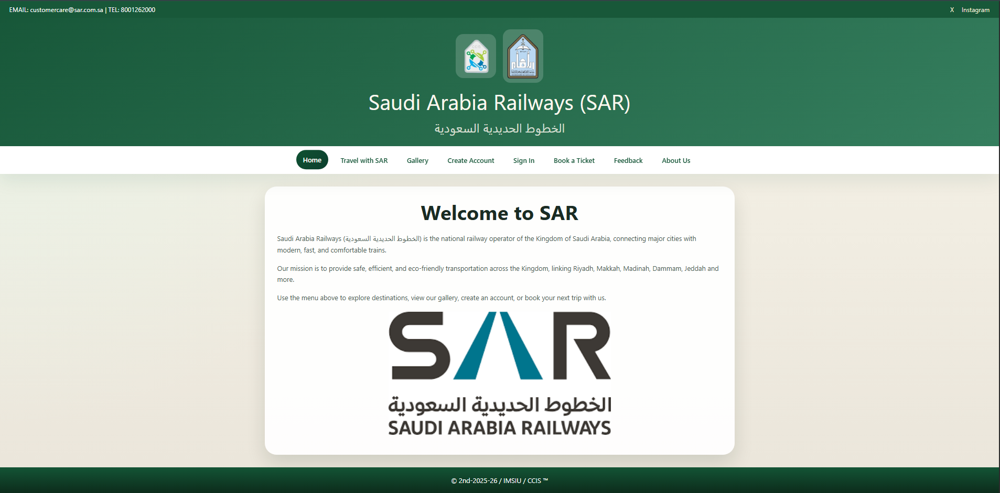
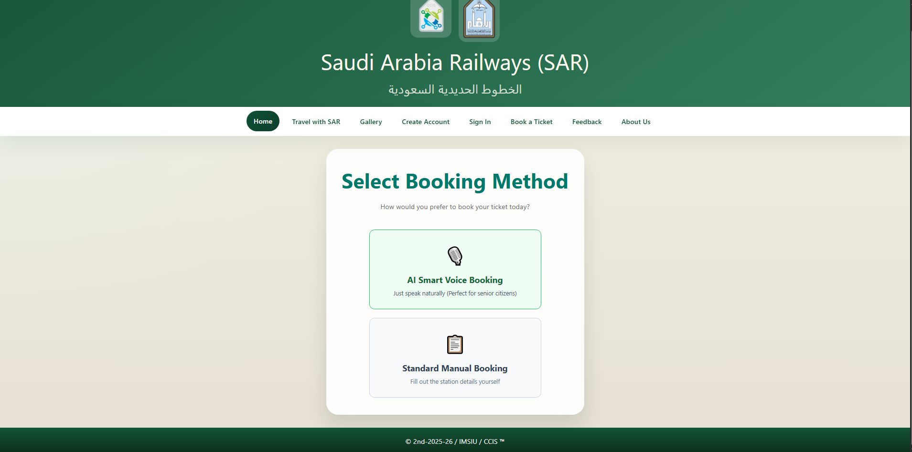
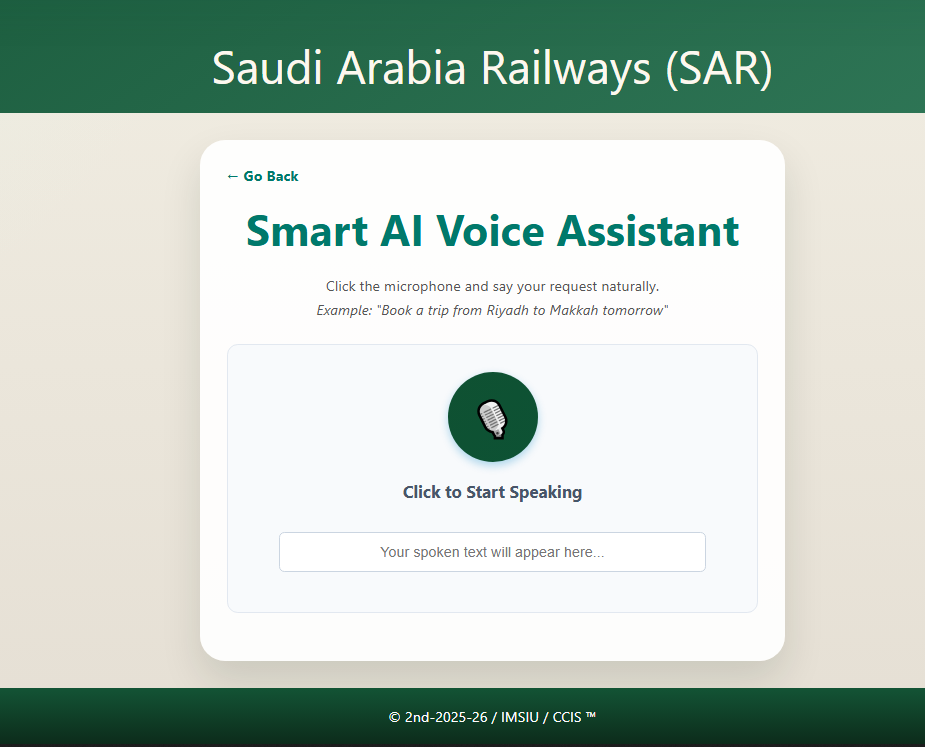
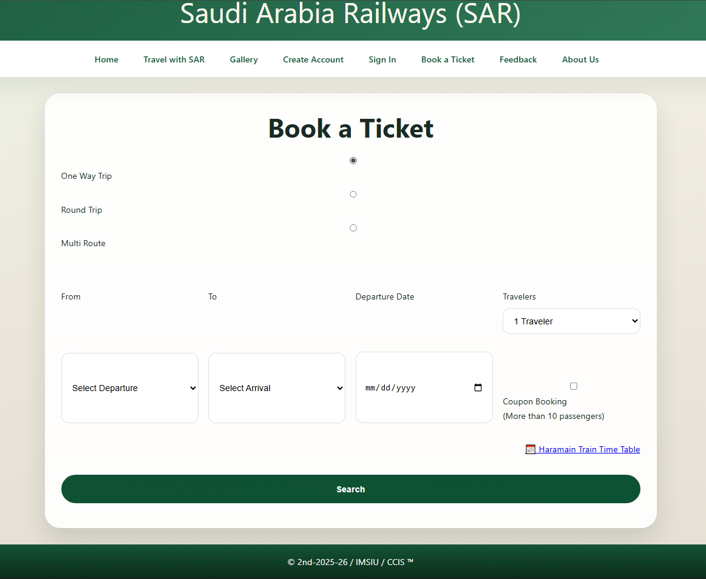

#  SAR Booking Website with AI Voice Assistant

###  Overview
**SAR Booking Website** is a modern web portal designed for Saudi Arabia Railways (SAR) to streamline train ticket reservations. The platform introduces a **Smart AI Voice Assistant** powered by the Web Speech API, enabling hands-free, natural language booking alongside a traditional manual reservation engine. Built with security and performance in mind, it features real-time validation checks, CAPTCHA protection, and custom PHP authentication.

---

###  Key Features

- 🎙️ **Smart AI Voice Assistant:** 
  - Allows passengers to issue natural speech queries (e.g., *"Book a trip from Riyadh to Makkah tomorrow"*).
  - Captures audio, parses travel entities (origin, destination, date), and auto-fills booking parameters instantly.
  - Achieves a **75% faster booking flow** (~6 seconds vs. ~24 seconds manual completion).

- 🎟️ **Dual Booking Engine:**
  - **Voice Booking:** Accessible hands-free option ideal for senior citizens and quick orders.
  - **Standard Manual Booking:** Supports One-Way, Round-Trip, and Multi-Route selections with dynamic dropdowns.

- ✔ **Front-End Validation & Smart Checks:**
  - JavaScript logic prevents circular trips (e.g., selecting the same origin and destination).
  - Dynamic user alerts and client-side checks reduce unnecessary backend requests.

- 🔐 **User Authentication & Security:**
  - Secure account creation and sign-in backed by PHP sessions.
  - Integrated CAPTCHA validation to protect against bot submissions.

- 🖼️ **Media Gallery & Support Gate:**
  - High-definition image and video galleries showcasing Haramain & SAR trains.
  - Interactive user feedback and support request forms.

---

###  Application Screenshots

  
   <em>Official Landing Page & Navigation Bar</em>

  
   <em>Dual Booking Option: AI Voice Assistant vs. Standard Manual Form</em>

  
   <em>AI Smart Voice Booking powered by Web Speech API</em>

  
   <em>Structured Reservation Form with Route Control</em>

